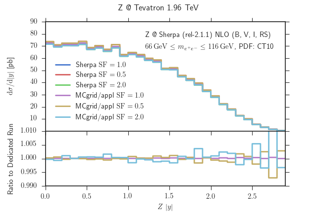

# heppyplot
A package for plotting histogrammed data with special support for high energy physics applications.




## Installation

Currently we use a custom fork of the excellent [seaborn](http://stanford.edu/~mwaskom/software/seaborn/) package.
```
git clone https://github.com/ebothmann/heppyplot.git
cd heppyplot
git submodule update --init
cd seaborn
pip install -e .
cd ..
pip install -e .
```
